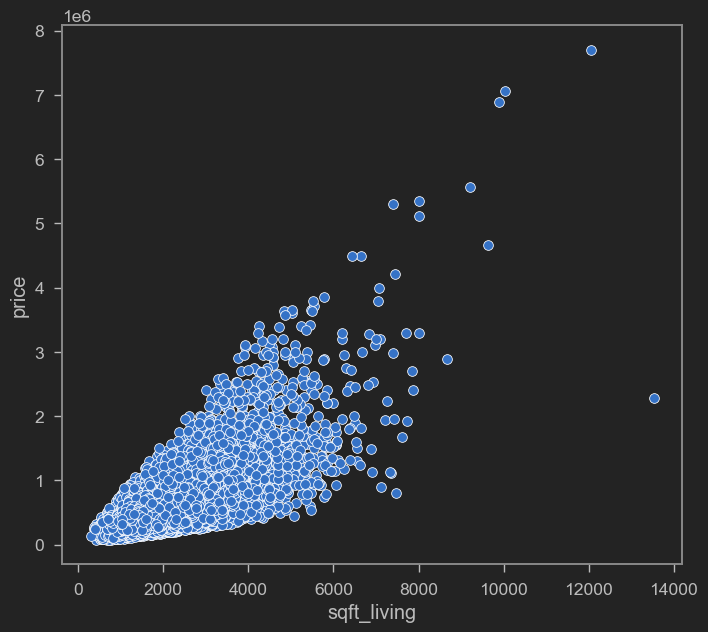
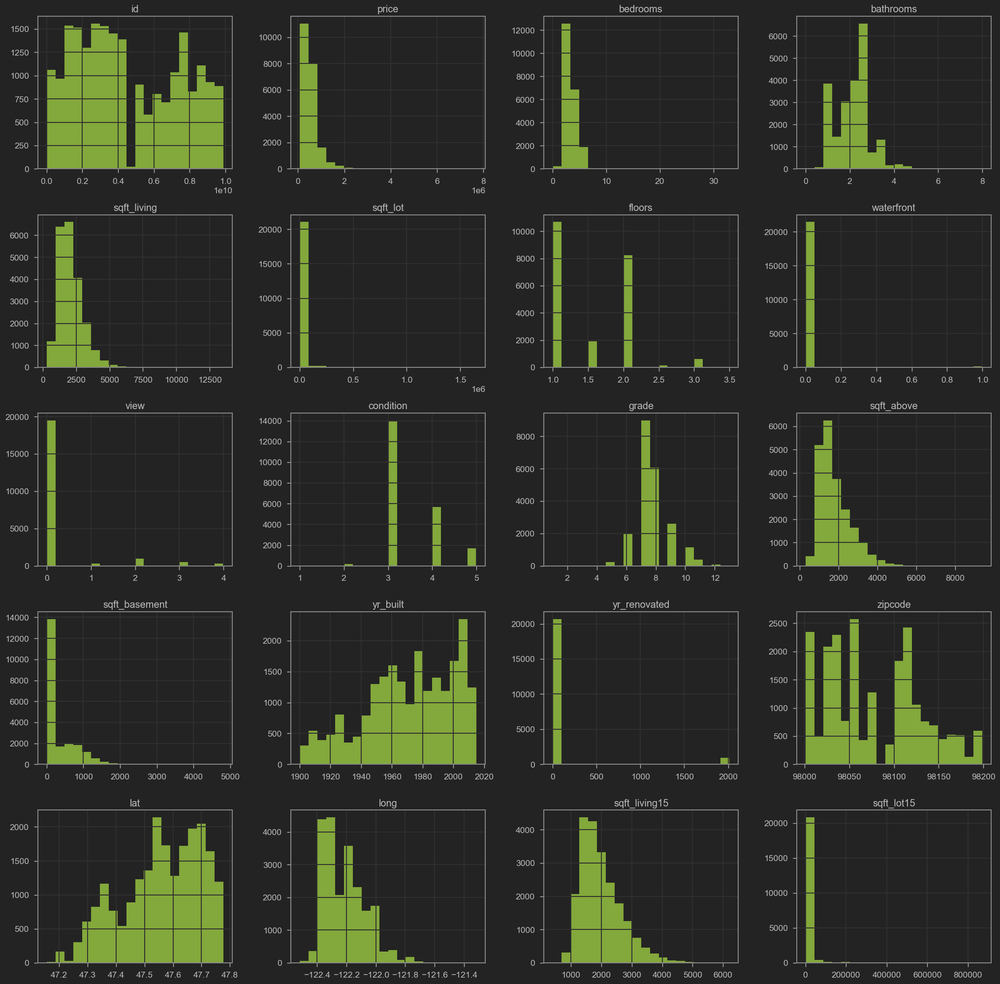
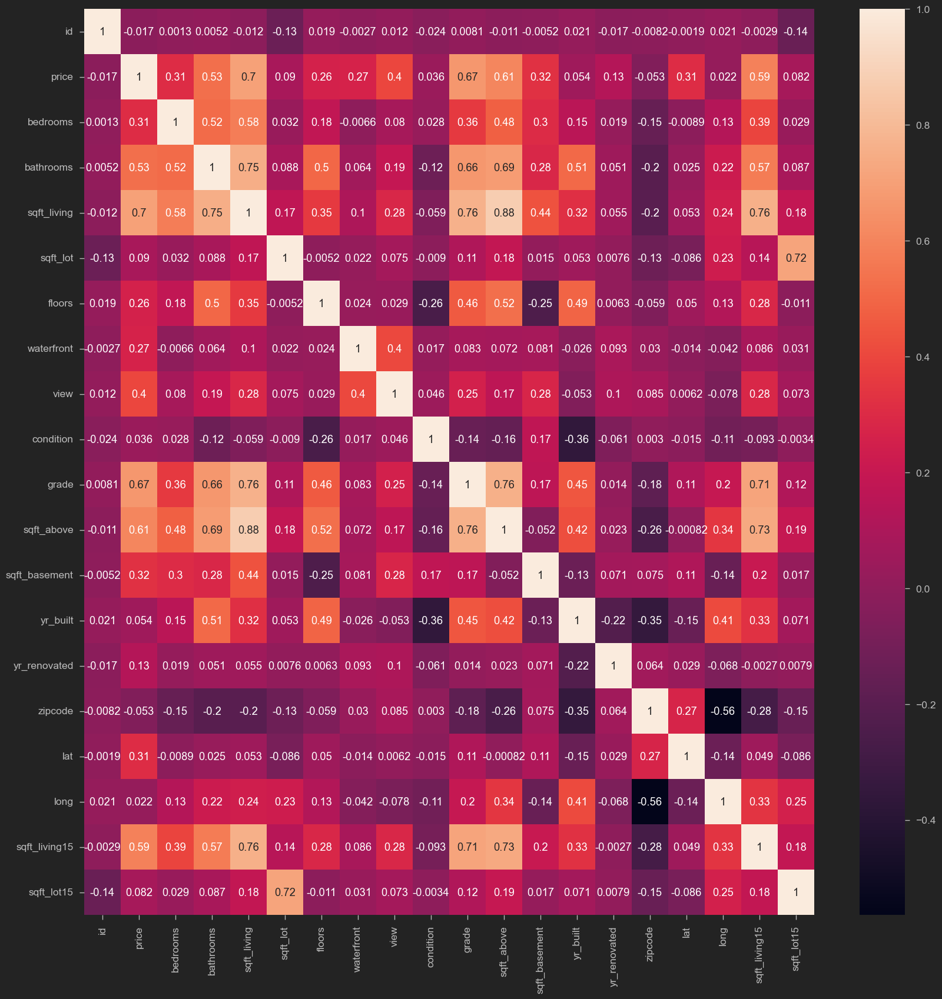
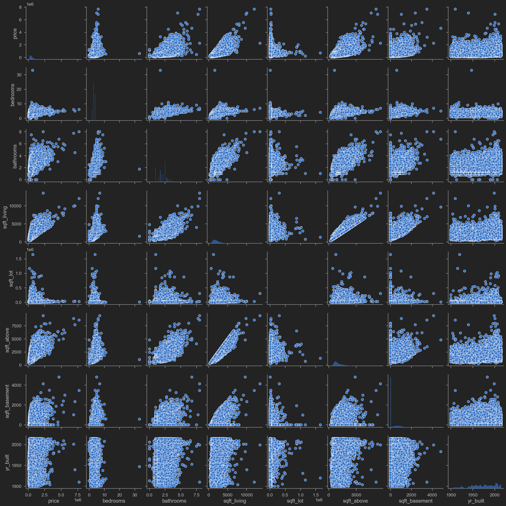
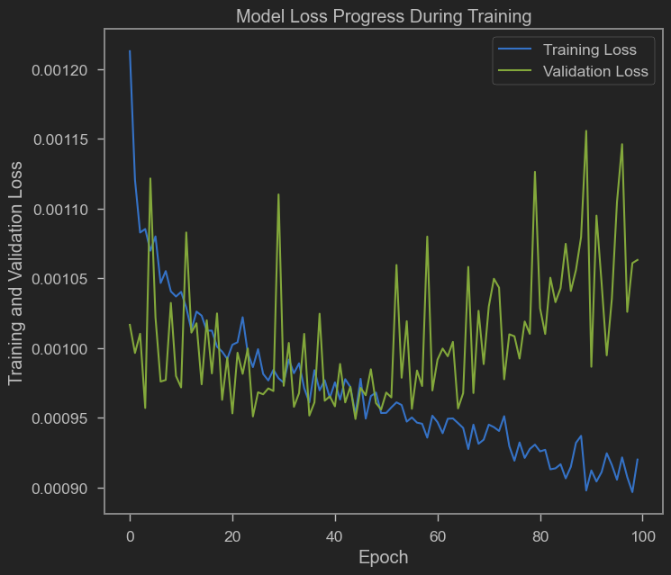
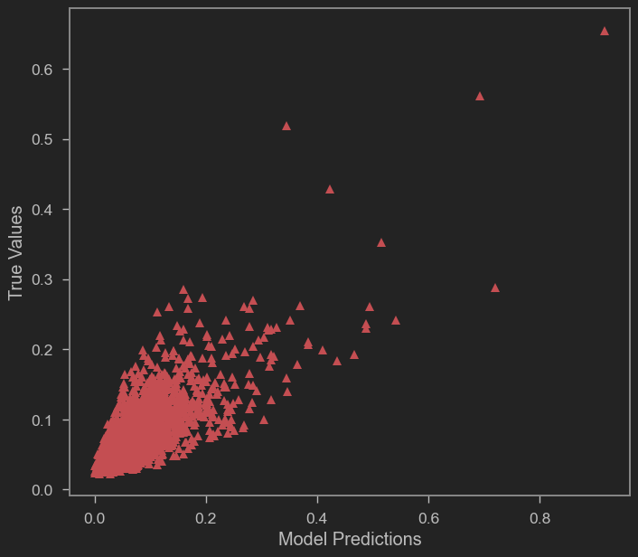
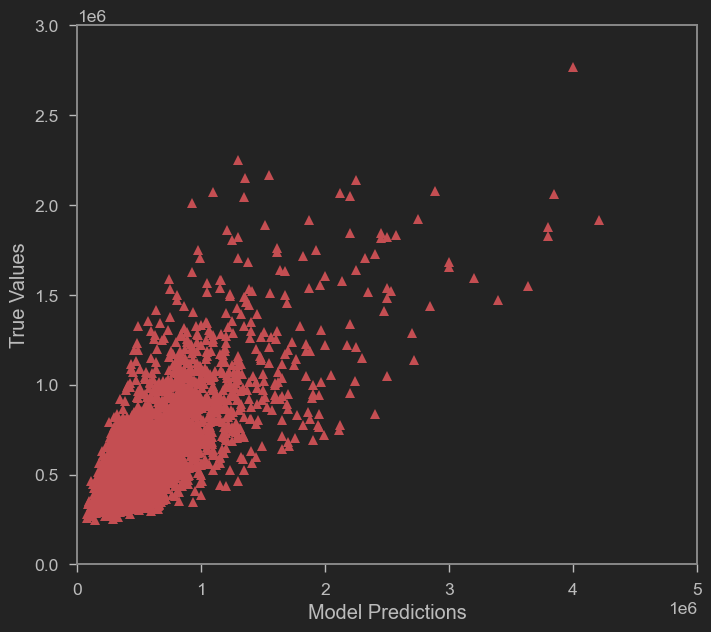
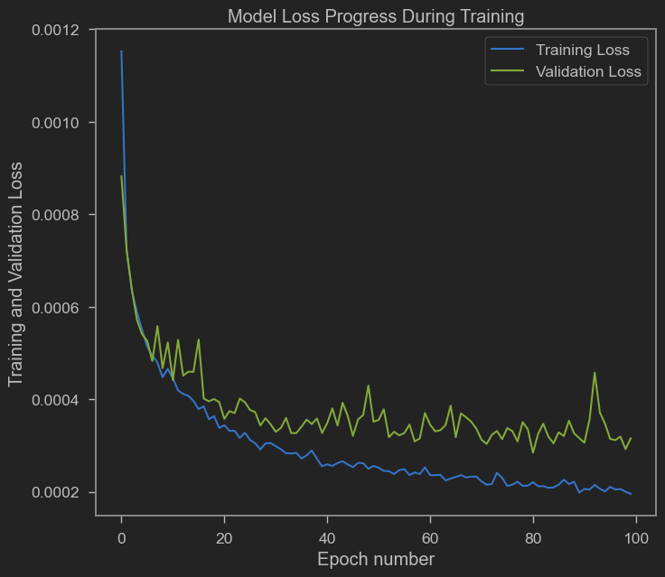
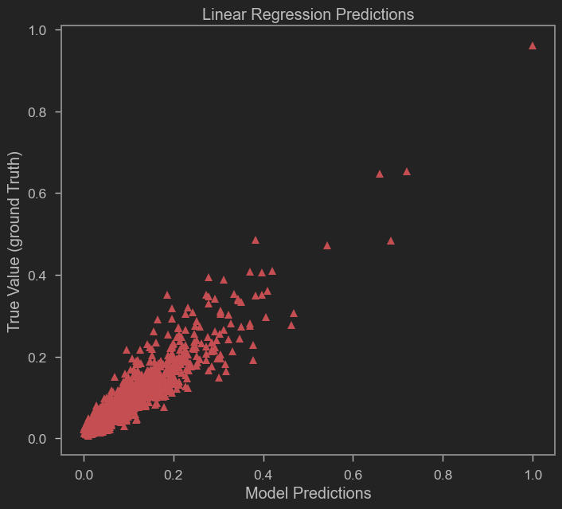

# The model predicts home sale prices in King County in the U.S. between May, 2014 and May, 2015 using several features such as number of bedrooms, bathrooms, view, and square footage.


```python
import pandas as pd
import numpy as np
import seaborn as sns
import matplotlib.pyplot as plt
import tensorflow.keras

from jupyterthemes import jtplot
jtplot.style(theme = 'monokai', context = 'notebook', ticks = True, grid = False)

from sklearn.preprocessing import MinMaxScaler
scaler = MinMaxScaler()

from sklearn.model_selection import train_test_split
from tensorflow.keras.models import Sequential 
from tensorflow.keras.layers import Dense
```


```python
houses_df = pd.read_csv('realestate_prices.csv',encoding='ISO-8859-1')
```


```python
houses_df.head(10)
```


<div>
<style scoped>
    .dataframe tbody tr th:only-of-type {
        vertical-align: middle;
    }

    .dataframe tbody tr th {
        vertical-align: top;
    }

    .dataframe thead th {
        text-align: right;
    }
</style>
<table border="1" class="dataframe">
  <thead>
    <tr style="text-align: right;">
      <th></th>
      <th>id</th>
      <th>date</th>
      <th>price</th>
      <th>bedrooms</th>
      <th>bathrooms</th>
      <th>sqft_living</th>
      <th>sqft_lot</th>
      <th>floors</th>
      <th>waterfront</th>
      <th>view</th>
      <th>...</th>
      <th>grade</th>
      <th>sqft_above</th>
      <th>sqft_basement</th>
      <th>yr_built</th>
      <th>yr_renovated</th>
      <th>zipcode</th>
      <th>lat</th>
      <th>long</th>
      <th>sqft_living15</th>
      <th>sqft_lot15</th>
    </tr>
  </thead>
  <tbody>
    <tr>
      <th>0</th>
      <td>7129300520</td>
      <td>20141013T000000</td>
      <td>221900.0</td>
      <td>3</td>
      <td>1.00</td>
      <td>1180</td>
      <td>5650</td>
      <td>1.0</td>
      <td>0</td>
      <td>0</td>
      <td>...</td>
      <td>7</td>
      <td>1180</td>
      <td>0</td>
      <td>1955</td>
      <td>0</td>
      <td>98178</td>
      <td>47.5112</td>
      <td>-122.257</td>
      <td>1340</td>
      <td>5650</td>
    </tr>
    <tr>
      <th>1</th>
      <td>6414100192</td>
      <td>20141209T000000</td>
      <td>538000.0</td>
      <td>3</td>
      <td>2.25</td>
      <td>2570</td>
      <td>7242</td>
      <td>2.0</td>
      <td>0</td>
      <td>0</td>
      <td>...</td>
      <td>7</td>
      <td>2170</td>
      <td>400</td>
      <td>1951</td>
      <td>1991</td>
      <td>98125</td>
      <td>47.7210</td>
      <td>-122.319</td>
      <td>1690</td>
      <td>7639</td>
    </tr>
    <tr>
      <th>2</th>
      <td>5631500400</td>
      <td>20150225T000000</td>
      <td>180000.0</td>
      <td>2</td>
      <td>1.00</td>
      <td>770</td>
      <td>10000</td>
      <td>1.0</td>
      <td>0</td>
      <td>0</td>
      <td>...</td>
      <td>6</td>
      <td>770</td>
      <td>0</td>
      <td>1933</td>
      <td>0</td>
      <td>98028</td>
      <td>47.7379</td>
      <td>-122.233</td>
      <td>2720</td>
      <td>8062</td>
    </tr>
    <tr>
      <th>3</th>
      <td>2487200875</td>
      <td>20141209T000000</td>
      <td>604000.0</td>
      <td>4</td>
      <td>3.00</td>
      <td>1960</td>
      <td>5000</td>
      <td>1.0</td>
      <td>0</td>
      <td>0</td>
      <td>...</td>
      <td>7</td>
      <td>1050</td>
      <td>910</td>
      <td>1965</td>
      <td>0</td>
      <td>98136</td>
      <td>47.5208</td>
      <td>-122.393</td>
      <td>1360</td>
      <td>5000</td>
    </tr>
    <tr>
      <th>4</th>
      <td>1954400510</td>
      <td>20150218T000000</td>
      <td>510000.0</td>
      <td>3</td>
      <td>2.00</td>
      <td>1680</td>
      <td>8080</td>
      <td>1.0</td>
      <td>0</td>
      <td>0</td>
      <td>...</td>
      <td>8</td>
      <td>1680</td>
      <td>0</td>
      <td>1987</td>
      <td>0</td>
      <td>98074</td>
      <td>47.6168</td>
      <td>-122.045</td>
      <td>1800</td>
      <td>7503</td>
    </tr>
    <tr>
      <th>5</th>
      <td>7237550310</td>
      <td>20140512T000000</td>
      <td>1225000.0</td>
      <td>4</td>
      <td>4.50</td>
      <td>5420</td>
      <td>101930</td>
      <td>1.0</td>
      <td>0</td>
      <td>0</td>
      <td>...</td>
      <td>11</td>
      <td>3890</td>
      <td>1530</td>
      <td>2001</td>
      <td>0</td>
      <td>98053</td>
      <td>47.6561</td>
      <td>-122.005</td>
      <td>4760</td>
      <td>101930</td>
    </tr>
    <tr>
      <th>6</th>
      <td>1321400060</td>
      <td>20140627T000000</td>
      <td>257500.0</td>
      <td>3</td>
      <td>2.25</td>
      <td>1715</td>
      <td>6819</td>
      <td>2.0</td>
      <td>0</td>
      <td>0</td>
      <td>...</td>
      <td>7</td>
      <td>1715</td>
      <td>0</td>
      <td>1995</td>
      <td>0</td>
      <td>98003</td>
      <td>47.3097</td>
      <td>-122.327</td>
      <td>2238</td>
      <td>6819</td>
    </tr>
    <tr>
      <th>7</th>
      <td>2008000270</td>
      <td>20150115T000000</td>
      <td>291850.0</td>
      <td>3</td>
      <td>1.50</td>
      <td>1060</td>
      <td>9711</td>
      <td>1.0</td>
      <td>0</td>
      <td>0</td>
      <td>...</td>
      <td>7</td>
      <td>1060</td>
      <td>0</td>
      <td>1963</td>
      <td>0</td>
      <td>98198</td>
      <td>47.4095</td>
      <td>-122.315</td>
      <td>1650</td>
      <td>9711</td>
    </tr>
    <tr>
      <th>8</th>
      <td>2414600126</td>
      <td>20150415T000000</td>
      <td>229500.0</td>
      <td>3</td>
      <td>1.00</td>
      <td>1780</td>
      <td>7470</td>
      <td>1.0</td>
      <td>0</td>
      <td>0</td>
      <td>...</td>
      <td>7</td>
      <td>1050</td>
      <td>730</td>
      <td>1960</td>
      <td>0</td>
      <td>98146</td>
      <td>47.5123</td>
      <td>-122.337</td>
      <td>1780</td>
      <td>8113</td>
    </tr>
    <tr>
      <th>9</th>
      <td>3793500160</td>
      <td>20150312T000000</td>
      <td>323000.0</td>
      <td>3</td>
      <td>2.50</td>
      <td>1890</td>
      <td>6560</td>
      <td>2.0</td>
      <td>0</td>
      <td>0</td>
      <td>...</td>
      <td>7</td>
      <td>1890</td>
      <td>0</td>
      <td>2003</td>
      <td>0</td>
      <td>98038</td>
      <td>47.3684</td>
      <td>-122.031</td>
      <td>2390</td>
      <td>7570</td>
    </tr>
  </tbody>
</table>
<p>10 rows × 21 columns</p>
</div>


```python
houses_df.tail(10)
```


<div>
<style scoped>
    .dataframe tbody tr th:only-of-type {
        vertical-align: middle;
    }

    .dataframe tbody tr th {
        vertical-align: top;
    }

    .dataframe thead th {
        text-align: right;
    }
</style>
<table border="1" class="dataframe">
  <thead>
    <tr style="text-align: right;">
      <th></th>
      <th>id</th>
      <th>date</th>
      <th>price</th>
      <th>bedrooms</th>
      <th>bathrooms</th>
      <th>sqft_living</th>
      <th>sqft_lot</th>
      <th>floors</th>
      <th>waterfront</th>
      <th>view</th>
      <th>...</th>
      <th>grade</th>
      <th>sqft_above</th>
      <th>sqft_basement</th>
      <th>yr_built</th>
      <th>yr_renovated</th>
      <th>zipcode</th>
      <th>lat</th>
      <th>long</th>
      <th>sqft_living15</th>
      <th>sqft_lot15</th>
    </tr>
  </thead>
  <tbody>
    <tr>
      <th>21603</th>
      <td>7852140040</td>
      <td>20140825T000000</td>
      <td>507250.0</td>
      <td>3</td>
      <td>2.50</td>
      <td>2270</td>
      <td>5536</td>
      <td>2.0</td>
      <td>0</td>
      <td>0</td>
      <td>...</td>
      <td>8</td>
      <td>2270</td>
      <td>0</td>
      <td>2003</td>
      <td>0</td>
      <td>98065</td>
      <td>47.5389</td>
      <td>-121.881</td>
      <td>2270</td>
      <td>5731</td>
    </tr>
    <tr>
      <th>21604</th>
      <td>9834201367</td>
      <td>20150126T000000</td>
      <td>429000.0</td>
      <td>3</td>
      <td>2.00</td>
      <td>1490</td>
      <td>1126</td>
      <td>3.0</td>
      <td>0</td>
      <td>0</td>
      <td>...</td>
      <td>8</td>
      <td>1490</td>
      <td>0</td>
      <td>2014</td>
      <td>0</td>
      <td>98144</td>
      <td>47.5699</td>
      <td>-122.288</td>
      <td>1400</td>
      <td>1230</td>
    </tr>
    <tr>
      <th>21605</th>
      <td>3448900210</td>
      <td>20141014T000000</td>
      <td>610685.0</td>
      <td>4</td>
      <td>2.50</td>
      <td>2520</td>
      <td>6023</td>
      <td>2.0</td>
      <td>0</td>
      <td>0</td>
      <td>...</td>
      <td>9</td>
      <td>2520</td>
      <td>0</td>
      <td>2014</td>
      <td>0</td>
      <td>98056</td>
      <td>47.5137</td>
      <td>-122.167</td>
      <td>2520</td>
      <td>6023</td>
    </tr>
    <tr>
      <th>21606</th>
      <td>7936000429</td>
      <td>20150326T000000</td>
      <td>1007500.0</td>
      <td>4</td>
      <td>3.50</td>
      <td>3510</td>
      <td>7200</td>
      <td>2.0</td>
      <td>0</td>
      <td>0</td>
      <td>...</td>
      <td>9</td>
      <td>2600</td>
      <td>910</td>
      <td>2009</td>
      <td>0</td>
      <td>98136</td>
      <td>47.5537</td>
      <td>-122.398</td>
      <td>2050</td>
      <td>6200</td>
    </tr>
    <tr>
      <th>21607</th>
      <td>2997800021</td>
      <td>20150219T000000</td>
      <td>475000.0</td>
      <td>3</td>
      <td>2.50</td>
      <td>1310</td>
      <td>1294</td>
      <td>2.0</td>
      <td>0</td>
      <td>0</td>
      <td>...</td>
      <td>8</td>
      <td>1180</td>
      <td>130</td>
      <td>2008</td>
      <td>0</td>
      <td>98116</td>
      <td>47.5773</td>
      <td>-122.409</td>
      <td>1330</td>
      <td>1265</td>
    </tr>
    <tr>
      <th>21608</th>
      <td>263000018</td>
      <td>20140521T000000</td>
      <td>360000.0</td>
      <td>3</td>
      <td>2.50</td>
      <td>1530</td>
      <td>1131</td>
      <td>3.0</td>
      <td>0</td>
      <td>0</td>
      <td>...</td>
      <td>8</td>
      <td>1530</td>
      <td>0</td>
      <td>2009</td>
      <td>0</td>
      <td>98103</td>
      <td>47.6993</td>
      <td>-122.346</td>
      <td>1530</td>
      <td>1509</td>
    </tr>
    <tr>
      <th>21609</th>
      <td>6600060120</td>
      <td>20150223T000000</td>
      <td>400000.0</td>
      <td>4</td>
      <td>2.50</td>
      <td>2310</td>
      <td>5813</td>
      <td>2.0</td>
      <td>0</td>
      <td>0</td>
      <td>...</td>
      <td>8</td>
      <td>2310</td>
      <td>0</td>
      <td>2014</td>
      <td>0</td>
      <td>98146</td>
      <td>47.5107</td>
      <td>-122.362</td>
      <td>1830</td>
      <td>7200</td>
    </tr>
    <tr>
      <th>21610</th>
      <td>1523300141</td>
      <td>20140623T000000</td>
      <td>402101.0</td>
      <td>2</td>
      <td>0.75</td>
      <td>1020</td>
      <td>1350</td>
      <td>2.0</td>
      <td>0</td>
      <td>0</td>
      <td>...</td>
      <td>7</td>
      <td>1020</td>
      <td>0</td>
      <td>2009</td>
      <td>0</td>
      <td>98144</td>
      <td>47.5944</td>
      <td>-122.299</td>
      <td>1020</td>
      <td>2007</td>
    </tr>
    <tr>
      <th>21611</th>
      <td>291310100</td>
      <td>20150116T000000</td>
      <td>400000.0</td>
      <td>3</td>
      <td>2.50</td>
      <td>1600</td>
      <td>2388</td>
      <td>2.0</td>
      <td>0</td>
      <td>0</td>
      <td>...</td>
      <td>8</td>
      <td>1600</td>
      <td>0</td>
      <td>2004</td>
      <td>0</td>
      <td>98027</td>
      <td>47.5345</td>
      <td>-122.069</td>
      <td>1410</td>
      <td>1287</td>
    </tr>
    <tr>
      <th>21612</th>
      <td>1523300157</td>
      <td>20141015T000000</td>
      <td>325000.0</td>
      <td>2</td>
      <td>0.75</td>
      <td>1020</td>
      <td>1076</td>
      <td>2.0</td>
      <td>0</td>
      <td>0</td>
      <td>...</td>
      <td>7</td>
      <td>1020</td>
      <td>0</td>
      <td>2008</td>
      <td>0</td>
      <td>98144</td>
      <td>47.5941</td>
      <td>-122.299</td>
      <td>1020</td>
      <td>1357</td>
    </tr>
  </tbody>
</table>
<p>10 rows × 21 columns</p>
</div>


```python
houses_df.info()
```

    <class 'pandas.core.frame.DataFrame'>
    RangeIndex: 21613 entries, 0 to 21612
    Data columns (total 21 columns):
     #   Column         Non-Null Count  Dtype  
    ---  ------         --------------  -----  
     0   id             21613 non-null  int64  
     1   date           21613 non-null  object 
     2   price          21613 non-null  float64
     3   bedrooms       21613 non-null  int64  
     4   bathrooms      21613 non-null  float64
     5   sqft_living    21613 non-null  int64  
     6   sqft_lot       21613 non-null  int64  
     7   floors         21613 non-null  float64
     8   waterfront     21613 non-null  int64  
     9   view           21613 non-null  int64  
     10  condition      21613 non-null  int64  
     11  grade          21613 non-null  int64  
     12  sqft_above     21613 non-null  int64  
     13  sqft_basement  21613 non-null  int64  
     14  yr_built       21613 non-null  int64  
     15  yr_renovated   21613 non-null  int64  
     16  zipcode        21613 non-null  int64  
     17  lat            21613 non-null  float64
     18  long           21613 non-null  float64
     19  sqft_living15  21613 non-null  int64  
     20  sqft_lot15     21613 non-null  int64  
    dtypes: float64(5), int64(15), object(1)
    memory usage: 3.5+ MB
    


```python
# Average values of different columns in real-estate data
houses_df.describe()
```


<div>
<style scoped>
    .dataframe tbody tr th:only-of-type {
        vertical-align: middle;
    }

    .dataframe tbody tr th {
        vertical-align: top;
    }

    .dataframe thead th {
        text-align: right;
    }
</style>
<table border="1" class="dataframe">
  <thead>
    <tr style="text-align: right;">
      <th></th>
      <th>id</th>
      <th>price</th>
      <th>bedrooms</th>
      <th>bathrooms</th>
      <th>sqft_living</th>
      <th>sqft_lot</th>
      <th>floors</th>
      <th>waterfront</th>
      <th>view</th>
      <th>condition</th>
      <th>grade</th>
      <th>sqft_above</th>
      <th>sqft_basement</th>
      <th>yr_built</th>
      <th>yr_renovated</th>
      <th>zipcode</th>
      <th>lat</th>
      <th>long</th>
      <th>sqft_living15</th>
      <th>sqft_lot15</th>
    </tr>
  </thead>
  <tbody>
    <tr>
      <th>count</th>
      <td>2.161300e+04</td>
      <td>2.161300e+04</td>
      <td>21613.000000</td>
      <td>21613.000000</td>
      <td>21613.000000</td>
      <td>2.161300e+04</td>
      <td>21613.000000</td>
      <td>21613.000000</td>
      <td>21613.000000</td>
      <td>21613.000000</td>
      <td>21613.000000</td>
      <td>21613.000000</td>
      <td>21613.000000</td>
      <td>21613.000000</td>
      <td>21613.000000</td>
      <td>21613.000000</td>
      <td>21613.000000</td>
      <td>21613.000000</td>
      <td>21613.000000</td>
      <td>21613.000000</td>
    </tr>
    <tr>
      <th>mean</th>
      <td>4.580302e+09</td>
      <td>5.400881e+05</td>
      <td>3.370842</td>
      <td>2.114757</td>
      <td>2079.899736</td>
      <td>1.510697e+04</td>
      <td>1.494309</td>
      <td>0.007542</td>
      <td>0.234303</td>
      <td>3.409430</td>
      <td>7.656873</td>
      <td>1788.390691</td>
      <td>291.509045</td>
      <td>1971.005136</td>
      <td>84.402258</td>
      <td>98077.939805</td>
      <td>47.560053</td>
      <td>-122.213896</td>
      <td>1986.552492</td>
      <td>12768.455652</td>
    </tr>
    <tr>
      <th>std</th>
      <td>2.876566e+09</td>
      <td>3.671272e+05</td>
      <td>0.930062</td>
      <td>0.770163</td>
      <td>918.440897</td>
      <td>4.142051e+04</td>
      <td>0.539989</td>
      <td>0.086517</td>
      <td>0.766318</td>
      <td>0.650743</td>
      <td>1.175459</td>
      <td>828.090978</td>
      <td>442.575043</td>
      <td>29.373411</td>
      <td>401.679240</td>
      <td>53.505026</td>
      <td>0.138564</td>
      <td>0.140828</td>
      <td>685.391304</td>
      <td>27304.179631</td>
    </tr>
    <tr>
      <th>min</th>
      <td>1.000102e+06</td>
      <td>7.500000e+04</td>
      <td>0.000000</td>
      <td>0.000000</td>
      <td>290.000000</td>
      <td>5.200000e+02</td>
      <td>1.000000</td>
      <td>0.000000</td>
      <td>0.000000</td>
      <td>1.000000</td>
      <td>1.000000</td>
      <td>290.000000</td>
      <td>0.000000</td>
      <td>1900.000000</td>
      <td>0.000000</td>
      <td>98001.000000</td>
      <td>47.155900</td>
      <td>-122.519000</td>
      <td>399.000000</td>
      <td>651.000000</td>
    </tr>
    <tr>
      <th>25%</th>
      <td>2.123049e+09</td>
      <td>3.219500e+05</td>
      <td>3.000000</td>
      <td>1.750000</td>
      <td>1427.000000</td>
      <td>5.040000e+03</td>
      <td>1.000000</td>
      <td>0.000000</td>
      <td>0.000000</td>
      <td>3.000000</td>
      <td>7.000000</td>
      <td>1190.000000</td>
      <td>0.000000</td>
      <td>1951.000000</td>
      <td>0.000000</td>
      <td>98033.000000</td>
      <td>47.471000</td>
      <td>-122.328000</td>
      <td>1490.000000</td>
      <td>5100.000000</td>
    </tr>
    <tr>
      <th>50%</th>
      <td>3.904930e+09</td>
      <td>4.500000e+05</td>
      <td>3.000000</td>
      <td>2.250000</td>
      <td>1910.000000</td>
      <td>7.618000e+03</td>
      <td>1.500000</td>
      <td>0.000000</td>
      <td>0.000000</td>
      <td>3.000000</td>
      <td>7.000000</td>
      <td>1560.000000</td>
      <td>0.000000</td>
      <td>1975.000000</td>
      <td>0.000000</td>
      <td>98065.000000</td>
      <td>47.571800</td>
      <td>-122.230000</td>
      <td>1840.000000</td>
      <td>7620.000000</td>
    </tr>
    <tr>
      <th>75%</th>
      <td>7.308900e+09</td>
      <td>6.450000e+05</td>
      <td>4.000000</td>
      <td>2.500000</td>
      <td>2550.000000</td>
      <td>1.068800e+04</td>
      <td>2.000000</td>
      <td>0.000000</td>
      <td>0.000000</td>
      <td>4.000000</td>
      <td>8.000000</td>
      <td>2210.000000</td>
      <td>560.000000</td>
      <td>1997.000000</td>
      <td>0.000000</td>
      <td>98118.000000</td>
      <td>47.678000</td>
      <td>-122.125000</td>
      <td>2360.000000</td>
      <td>10083.000000</td>
    </tr>
    <tr>
      <th>max</th>
      <td>9.900000e+09</td>
      <td>7.700000e+06</td>
      <td>33.000000</td>
      <td>8.000000</td>
      <td>13540.000000</td>
      <td>1.651359e+06</td>
      <td>3.500000</td>
      <td>1.000000</td>
      <td>4.000000</td>
      <td>5.000000</td>
      <td>13.000000</td>
      <td>9410.000000</td>
      <td>4820.000000</td>
      <td>2015.000000</td>
      <td>2015.000000</td>
      <td>98199.000000</td>
      <td>47.777600</td>
      <td>-121.315000</td>
      <td>6210.000000</td>
      <td>871200.000000</td>
    </tr>
  </tbody>
</table>
</div>


```python
# Checking price as a function of living sqft
sns.scatterplot(x = 'sqft_living', y = 'price', data = houses_df)
```


    <Axes: xlabel='sqft_living', ylabel='price'>


    

    


```python
# Plot histograms for various columns in real-estate dataset
houses_df.hist(bins = 20, figsize = (25,25), color='g')
```


    array([[<Axes: title={'center': 'id'}>,
            <Axes: title={'center': 'price'}>,
            <Axes: title={'center': 'bedrooms'}>,
            <Axes: title={'center': 'bathrooms'}>],
           [<Axes: title={'center': 'sqft_living'}>,
            <Axes: title={'center': 'sqft_lot'}>,
            <Axes: title={'center': 'floors'}>,
            <Axes: title={'center': 'waterfront'}>],
           [<Axes: title={'center': 'view'}>,
            <Axes: title={'center': 'condition'}>,
            <Axes: title={'center': 'grade'}>,
            <Axes: title={'center': 'sqft_above'}>],
           [<Axes: title={'center': 'sqft_basement'}>,
            <Axes: title={'center': 'yr_built'}>,
            <Axes: title={'center': 'yr_renovated'}>,
            <Axes: title={'center': 'zipcode'}>],
           [<Axes: title={'center': 'lat'}>,
            <Axes: title={'center': 'long'}>,
            <Axes: title={'center': 'sqft_living15'}>,
            <Axes: title={'center': 'sqft_lot15'}>]], dtype=object)


    

    


```python
#Plotting heatmap for better understanding the relations
f, ax = plt.subplots(figsize=(20,20))
sns.heatmap(houses_df.corr(), annot = True)
```

    C:\Users\komal\AppData\Local\Temp\ipykernel_25444\2470800714.py:3: FutureWarning: The default value of numeric_only in DataFrame.corr is deprecated. In a future version, it will default to False. Select only valid columns or specify the value of numeric_only to silence this warning.
      sns.heatmap(houses_df.corr(), annot = True)
    


    <Axes: >


    

    


```python
houses_df_sample = houses_df[['price', 'bedrooms', 'bathrooms', 'sqft_living', 'sqft_lot', 'sqft_above', 'sqft_basement', 'yr_built']]
houses_df_sample
```


<div>
<style scoped>
    .dataframe tbody tr th:only-of-type {
        vertical-align: middle;
    }

    .dataframe tbody tr th {
        vertical-align: top;
    }

    .dataframe thead th {
        text-align: right;
    }
</style>
<table border="1" class="dataframe">
  <thead>
    <tr style="text-align: right;">
      <th></th>
      <th>price</th>
      <th>bedrooms</th>
      <th>bathrooms</th>
      <th>sqft_living</th>
      <th>sqft_lot</th>
      <th>sqft_above</th>
      <th>sqft_basement</th>
      <th>yr_built</th>
    </tr>
  </thead>
  <tbody>
    <tr>
      <th>0</th>
      <td>221900.0</td>
      <td>3</td>
      <td>1.00</td>
      <td>1180</td>
      <td>5650</td>
      <td>1180</td>
      <td>0</td>
      <td>1955</td>
    </tr>
    <tr>
      <th>1</th>
      <td>538000.0</td>
      <td>3</td>
      <td>2.25</td>
      <td>2570</td>
      <td>7242</td>
      <td>2170</td>
      <td>400</td>
      <td>1951</td>
    </tr>
    <tr>
      <th>2</th>
      <td>180000.0</td>
      <td>2</td>
      <td>1.00</td>
      <td>770</td>
      <td>10000</td>
      <td>770</td>
      <td>0</td>
      <td>1933</td>
    </tr>
    <tr>
      <th>3</th>
      <td>604000.0</td>
      <td>4</td>
      <td>3.00</td>
      <td>1960</td>
      <td>5000</td>
      <td>1050</td>
      <td>910</td>
      <td>1965</td>
    </tr>
    <tr>
      <th>4</th>
      <td>510000.0</td>
      <td>3</td>
      <td>2.00</td>
      <td>1680</td>
      <td>8080</td>
      <td>1680</td>
      <td>0</td>
      <td>1987</td>
    </tr>
    <tr>
      <th>...</th>
      <td>...</td>
      <td>...</td>
      <td>...</td>
      <td>...</td>
      <td>...</td>
      <td>...</td>
      <td>...</td>
      <td>...</td>
    </tr>
    <tr>
      <th>21608</th>
      <td>360000.0</td>
      <td>3</td>
      <td>2.50</td>
      <td>1530</td>
      <td>1131</td>
      <td>1530</td>
      <td>0</td>
      <td>2009</td>
    </tr>
    <tr>
      <th>21609</th>
      <td>400000.0</td>
      <td>4</td>
      <td>2.50</td>
      <td>2310</td>
      <td>5813</td>
      <td>2310</td>
      <td>0</td>
      <td>2014</td>
    </tr>
    <tr>
      <th>21610</th>
      <td>402101.0</td>
      <td>2</td>
      <td>0.75</td>
      <td>1020</td>
      <td>1350</td>
      <td>1020</td>
      <td>0</td>
      <td>2009</td>
    </tr>
    <tr>
      <th>21611</th>
      <td>400000.0</td>
      <td>3</td>
      <td>2.50</td>
      <td>1600</td>
      <td>2388</td>
      <td>1600</td>
      <td>0</td>
      <td>2004</td>
    </tr>
    <tr>
      <th>21612</th>
      <td>325000.0</td>
      <td>2</td>
      <td>0.75</td>
      <td>1020</td>
      <td>1076</td>
      <td>1020</td>
      <td>0</td>
      <td>2008</td>
    </tr>
  </tbody>
</table>
<p>21613 rows × 8 columns</p>
</div>


```python
# Pairploting different pairs of variables(columns)
sns.pairplot(houses_df_sample)
```


    <seaborn.axisgrid.PairGrid at 0x1b281492910>


    

    


```python
# Selecting features for training
selected_house_features = ['bedrooms', 'bathrooms', 'sqft_living', 'sqft_lot', 'floors', 'sqft_above', 'sqft_basement']
x_feats = houses_df[selected_house_features]
x_feats
```


<div>
<style scoped>
    .dataframe tbody tr th:only-of-type {
        vertical-align: middle;
    }

    .dataframe tbody tr th {
        vertical-align: top;
    }

    .dataframe thead th {
        text-align: right;
    }
</style>
<table border="1" class="dataframe">
  <thead>
    <tr style="text-align: right;">
      <th></th>
      <th>bedrooms</th>
      <th>bathrooms</th>
      <th>sqft_living</th>
      <th>sqft_lot</th>
      <th>floors</th>
      <th>sqft_above</th>
      <th>sqft_basement</th>
    </tr>
  </thead>
  <tbody>
    <tr>
      <th>0</th>
      <td>3</td>
      <td>1.00</td>
      <td>1180</td>
      <td>5650</td>
      <td>1.0</td>
      <td>1180</td>
      <td>0</td>
    </tr>
    <tr>
      <th>1</th>
      <td>3</td>
      <td>2.25</td>
      <td>2570</td>
      <td>7242</td>
      <td>2.0</td>
      <td>2170</td>
      <td>400</td>
    </tr>
    <tr>
      <th>2</th>
      <td>2</td>
      <td>1.00</td>
      <td>770</td>
      <td>10000</td>
      <td>1.0</td>
      <td>770</td>
      <td>0</td>
    </tr>
    <tr>
      <th>3</th>
      <td>4</td>
      <td>3.00</td>
      <td>1960</td>
      <td>5000</td>
      <td>1.0</td>
      <td>1050</td>
      <td>910</td>
    </tr>
    <tr>
      <th>4</th>
      <td>3</td>
      <td>2.00</td>
      <td>1680</td>
      <td>8080</td>
      <td>1.0</td>
      <td>1680</td>
      <td>0</td>
    </tr>
    <tr>
      <th>...</th>
      <td>...</td>
      <td>...</td>
      <td>...</td>
      <td>...</td>
      <td>...</td>
      <td>...</td>
      <td>...</td>
    </tr>
    <tr>
      <th>21608</th>
      <td>3</td>
      <td>2.50</td>
      <td>1530</td>
      <td>1131</td>
      <td>3.0</td>
      <td>1530</td>
      <td>0</td>
    </tr>
    <tr>
      <th>21609</th>
      <td>4</td>
      <td>2.50</td>
      <td>2310</td>
      <td>5813</td>
      <td>2.0</td>
      <td>2310</td>
      <td>0</td>
    </tr>
    <tr>
      <th>21610</th>
      <td>2</td>
      <td>0.75</td>
      <td>1020</td>
      <td>1350</td>
      <td>2.0</td>
      <td>1020</td>
      <td>0</td>
    </tr>
    <tr>
      <th>21611</th>
      <td>3</td>
      <td>2.50</td>
      <td>1600</td>
      <td>2388</td>
      <td>2.0</td>
      <td>1600</td>
      <td>0</td>
    </tr>
    <tr>
      <th>21612</th>
      <td>2</td>
      <td>0.75</td>
      <td>1020</td>
      <td>1076</td>
      <td>2.0</td>
      <td>1020</td>
      <td>0</td>
    </tr>
  </tbody>
</table>
<p>21613 rows × 7 columns</p>
</div>


```python
# Response variable price
y = houses_df['price']
y
```


    0        221900.0
    1        538000.0
    2        180000.0
    3        604000.0
    4        510000.0
               ...   
    21608    360000.0
    21609    400000.0
    21610    402101.0
    21611    400000.0
    21612    325000.0
    Name: price, Length: 21613, dtype: float64


```python
# Scaling the data so as they are in specific or similar range
x_feats_scaled = scaler.fit_transform(x_feats)
x_feats_scaled
```


    array([[0.09090909, 0.125     , 0.06716981, ..., 0.        , 0.09758772,
            0.        ],
           [0.09090909, 0.28125   , 0.17207547, ..., 0.4       , 0.20614035,
            0.08298755],
           [0.06060606, 0.125     , 0.03622642, ..., 0.        , 0.05263158,
            0.        ],
           ...,
           [0.06060606, 0.09375   , 0.05509434, ..., 0.4       , 0.08004386,
            0.        ],
           [0.09090909, 0.3125    , 0.09886792, ..., 0.4       , 0.14364035,
            0.        ],
           [0.06060606, 0.09375   , 0.05509434, ..., 0.4       , 0.08004386,
            0.        ]])


```python
y = y.values.reshape(-1, 1)
y_scaled = scaler.fit_transform(y)
y_scaled
```


    array([[0.01926557],
           [0.06072131],
           [0.01377049],
           ...,
           [0.04289849],
           [0.04262295],
           [0.03278689]])


```python
# Splitting data into training and testing
x_train,x_test,y_train,y_test = train_test_split(x_feats_scaled,y_scaled,test_size = 0.25)
```


```python
# Training a Deep learning Model

model = Sequential()
model.add(Dense(100, input_dim = 7, activation = 'relu'))
model.add(Dense(100, activation='relu'))
model.add(Dense(100, activation='relu'))
model.add(Dense(1, activation = 'linear'))

model.summary()

model.compile(optimizer = 'Adam', loss = 'mean_squared_error')
epochs_hist = model.fit(x_train, y_train, epochs = 100, batch_size = 50, validation_split = 0.2)
```

    Model: "sequential_8"
    _________________________________________________________________
     Layer (type)                Output Shape              Param #   
    =================================================================
     dense_43 (Dense)            (None, 100)               800       
                                                                     
     dense_44 (Dense)            (None, 100)               10100     
                                                                     
     dense_45 (Dense)            (None, 100)               10100     
                                                                     
     dense_46 (Dense)            (None, 1)                 101       
                                                                     
    =================================================================
    Total params: 21101 (82.43 KB)
    Trainable params: 21101 (82.43 KB)
    Non-trainable params: 0 (0.00 Byte)
    _________________________________________________________________
    Epoch 1/100
    260/260 [==============================] - 1s 1ms/step - loss: 0.0012 - val_loss: 0.0010
    Epoch 2/100
    260/260 [==============================] - 0s 1ms/step - loss: 0.0011 - val_loss: 9.9653e-04
    Epoch 3/100
    260/260 [==============================] - 0s 1ms/step - loss: 0.0011 - val_loss: 0.0010
    Epoch 4/100
    260/260 [==============================] - 0s 1ms/step - loss: 0.0011 - val_loss: 9.5709e-04
    Epoch 5/100
    260/260 [==============================] - 0s 1ms/step - loss: 0.0011 - val_loss: 0.0011
    Epoch 6/100
    260/260 [==============================] - 0s 1ms/step - loss: 0.0011 - val_loss: 0.0010
    Epoch 7/100
    260/260 [==============================] - 0s 1ms/step - loss: 0.0010 - val_loss: 9.7603e-04
    Epoch 8/100
    260/260 [==============================] - 0s 1ms/step - loss: 0.0011 - val_loss: 9.7718e-04
    Epoch 9/100
    260/260 [==============================] - 0s 1ms/step - loss: 0.0010 - val_loss: 0.0010
    Epoch 10/100
    260/260 [==============================] - 0s 1ms/step - loss: 0.0010 - val_loss: 9.8003e-04
    Epoch 11/100
    260/260 [==============================] - 0s 1ms/step - loss: 0.0010 - val_loss: 9.7182e-04
    Epoch 12/100
    260/260 [==============================] - 0s 1ms/step - loss: 0.0010 - val_loss: 0.0011
    Epoch 13/100
    260/260 [==============================] - 0s 1ms/step - loss: 0.0010 - val_loss: 0.0010
    Epoch 14/100
    260/260 [==============================] - 0s 1ms/step - loss: 0.0010 - val_loss: 0.0010
    Epoch 15/100
    260/260 [==============================] - 0s 1ms/step - loss: 0.0010 - val_loss: 9.7406e-04
    Epoch 16/100
    260/260 [==============================] - 0s 1ms/step - loss: 0.0010 - val_loss: 0.0010
    Epoch 17/100
    260/260 [==============================] - 0s 1ms/step - loss: 0.0010 - val_loss: 9.8188e-04
    Epoch 18/100
    260/260 [==============================] - 0s 1ms/step - loss: 0.0010 - val_loss: 0.0010
    Epoch 19/100
    260/260 [==============================] - 0s 1ms/step - loss: 9.9751e-04 - val_loss: 9.6292e-04
    Epoch 20/100
    260/260 [==============================] - 0s 1ms/step - loss: 9.9234e-04 - val_loss: 9.9318e-04
    Epoch 21/100
    260/260 [==============================] - 0s 1ms/step - loss: 0.0010 - val_loss: 9.5322e-04
    Epoch 22/100
    260/260 [==============================] - 0s 1ms/step - loss: 0.0010 - val_loss: 9.9670e-04
    Epoch 23/100
    260/260 [==============================] - 0s 1ms/step - loss: 0.0010 - val_loss: 9.8155e-04
    Epoch 24/100
    260/260 [==============================] - 0s 1ms/step - loss: 9.9652e-04 - val_loss: 9.9975e-04
    Epoch 25/100
    260/260 [==============================] - 0s 1ms/step - loss: 9.8638e-04 - val_loss: 9.5102e-04
    Epoch 26/100
    260/260 [==============================] - 0s 1ms/step - loss: 9.9928e-04 - val_loss: 9.6836e-04
    Epoch 27/100
    260/260 [==============================] - 0s 1ms/step - loss: 9.8148e-04 - val_loss: 9.6688e-04
    Epoch 28/100
    260/260 [==============================] - 0s 1ms/step - loss: 9.7682e-04 - val_loss: 9.7115e-04
    Epoch 29/100
    260/260 [==============================] - 0s 1ms/step - loss: 9.8447e-04 - val_loss: 9.6926e-04
    Epoch 30/100
    260/260 [==============================] - 0s 1ms/step - loss: 9.7840e-04 - val_loss: 0.0011
    Epoch 31/100
    260/260 [==============================] - 0s 1ms/step - loss: 9.7527e-04 - val_loss: 9.7297e-04
    Epoch 32/100
    260/260 [==============================] - 0s 1ms/step - loss: 9.9180e-04 - val_loss: 0.0010
    Epoch 33/100
    260/260 [==============================] - 0s 1ms/step - loss: 9.8202e-04 - val_loss: 9.5790e-04
    Epoch 34/100
    260/260 [==============================] - 0s 1ms/step - loss: 9.8912e-04 - val_loss: 9.6775e-04
    Epoch 35/100
    260/260 [==============================] - 0s 1ms/step - loss: 9.7133e-04 - val_loss: 0.0010
    Epoch 36/100
    260/260 [==============================] - 0s 1ms/step - loss: 9.6107e-04 - val_loss: 9.5163e-04
    Epoch 37/100
    260/260 [==============================] - 0s 1ms/step - loss: 9.8423e-04 - val_loss: 9.6109e-04
    Epoch 38/100
    260/260 [==============================] - 0s 1ms/step - loss: 9.6972e-04 - val_loss: 0.0010
    Epoch 39/100
    260/260 [==============================] - 0s 1ms/step - loss: 9.7699e-04 - val_loss: 9.6229e-04
    Epoch 40/100
    260/260 [==============================] - 0s 1ms/step - loss: 9.6441e-04 - val_loss: 9.6544e-04
    Epoch 41/100
    260/260 [==============================] - 0s 1ms/step - loss: 9.7546e-04 - val_loss: 9.5825e-04
    Epoch 42/100
    260/260 [==============================] - 0s 1ms/step - loss: 9.6309e-04 - val_loss: 9.8867e-04
    Epoch 43/100
    260/260 [==============================] - 0s 1ms/step - loss: 9.7776e-04 - val_loss: 9.6108e-04
    Epoch 44/100
    260/260 [==============================] - 0s 1ms/step - loss: 9.7216e-04 - val_loss: 9.7226e-04
    Epoch 45/100
    260/260 [==============================] - 0s 1ms/step - loss: 9.5257e-04 - val_loss: 9.4920e-04
    Epoch 46/100
    260/260 [==============================] - 0s 1ms/step - loss: 9.7800e-04 - val_loss: 9.7152e-04
    Epoch 47/100
    260/260 [==============================] - 0s 1ms/step - loss: 9.4944e-04 - val_loss: 9.6621e-04
    Epoch 48/100
    260/260 [==============================] - 0s 1ms/step - loss: 9.6563e-04 - val_loss: 9.8487e-04
    Epoch 49/100
    260/260 [==============================] - 0s 1ms/step - loss: 9.6816e-04 - val_loss: 9.6061e-04
    Epoch 50/100
    260/260 [==============================] - 0s 1ms/step - loss: 9.5346e-04 - val_loss: 9.5594e-04
    Epoch 51/100
    260/260 [==============================] - 0s 1ms/step - loss: 9.5356e-04 - val_loss: 9.6815e-04
    Epoch 52/100
    260/260 [==============================] - 0s 1ms/step - loss: 9.5751e-04 - val_loss: 9.6465e-04
    Epoch 53/100
    260/260 [==============================] - 0s 1ms/step - loss: 9.6112e-04 - val_loss: 0.0011
    Epoch 54/100
    260/260 [==============================] - 0s 1ms/step - loss: 9.5923e-04 - val_loss: 9.7876e-04
    Epoch 55/100
    260/260 [==============================] - 0s 1ms/step - loss: 9.4730e-04 - val_loss: 0.0010
    Epoch 56/100
    260/260 [==============================] - 0s 1ms/step - loss: 9.5030e-04 - val_loss: 9.5648e-04
    Epoch 57/100
    260/260 [==============================] - 0s 1ms/step - loss: 9.4659e-04 - val_loss: 9.8396e-04
    Epoch 58/100
    260/260 [==============================] - 0s 1ms/step - loss: 9.4577e-04 - val_loss: 9.7281e-04
    Epoch 59/100
    260/260 [==============================] - 0s 1ms/step - loss: 9.3580e-04 - val_loss: 0.0011
    Epoch 60/100
    260/260 [==============================] - 0s 1ms/step - loss: 9.5156e-04 - val_loss: 9.6965e-04
    Epoch 61/100
    260/260 [==============================] - 0s 1ms/step - loss: 9.4692e-04 - val_loss: 9.9175e-04
    Epoch 62/100
    260/260 [==============================] - 0s 1ms/step - loss: 9.3898e-04 - val_loss: 9.9971e-04
    Epoch 63/100
    260/260 [==============================] - 0s 1ms/step - loss: 9.4936e-04 - val_loss: 9.9417e-04
    Epoch 64/100
    260/260 [==============================] - 0s 1ms/step - loss: 9.4960e-04 - val_loss: 0.0010
    Epoch 65/100
    260/260 [==============================] - 0s 1ms/step - loss: 9.4625e-04 - val_loss: 9.5676e-04
    Epoch 66/100
    260/260 [==============================] - 0s 1ms/step - loss: 9.4276e-04 - val_loss: 9.6769e-04
    Epoch 67/100
    260/260 [==============================] - 0s 1ms/step - loss: 9.2764e-04 - val_loss: 0.0011
    Epoch 68/100
    260/260 [==============================] - 0s 1ms/step - loss: 9.4515e-04 - val_loss: 9.6779e-04
    Epoch 69/100
    260/260 [==============================] - 0s 1ms/step - loss: 9.3143e-04 - val_loss: 0.0010
    Epoch 70/100
    260/260 [==============================] - 0s 1ms/step - loss: 9.3433e-04 - val_loss: 9.8855e-04
    Epoch 71/100
    260/260 [==============================] - 0s 1ms/step - loss: 9.4514e-04 - val_loss: 0.0010
    Epoch 72/100
    260/260 [==============================] - 0s 1ms/step - loss: 9.4333e-04 - val_loss: 0.0010
    Epoch 73/100
    260/260 [==============================] - 0s 1ms/step - loss: 9.4060e-04 - val_loss: 0.0010
    Epoch 74/100
    260/260 [==============================] - 0s 1ms/step - loss: 9.5121e-04 - val_loss: 9.7765e-04
    Epoch 75/100
    260/260 [==============================] - 0s 1ms/step - loss: 9.2970e-04 - val_loss: 0.0010
    Epoch 76/100
    260/260 [==============================] - 0s 1ms/step - loss: 9.1929e-04 - val_loss: 0.0010
    Epoch 77/100
    260/260 [==============================] - 0s 1ms/step - loss: 9.3238e-04 - val_loss: 9.9248e-04
    Epoch 78/100
    260/260 [==============================] - 0s 1ms/step - loss: 9.2128e-04 - val_loss: 0.0010
    Epoch 79/100
    260/260 [==============================] - 0s 1ms/step - loss: 9.2768e-04 - val_loss: 0.0010
    Epoch 80/100
    260/260 [==============================] - 0s 1ms/step - loss: 9.3080e-04 - val_loss: 0.0011
    Epoch 81/100
    260/260 [==============================] - 0s 1ms/step - loss: 9.2597e-04 - val_loss: 0.0010
    Epoch 82/100
    260/260 [==============================] - 0s 1ms/step - loss: 9.2710e-04 - val_loss: 0.0010
    Epoch 83/100
    260/260 [==============================] - 0s 1ms/step - loss: 9.1311e-04 - val_loss: 0.0011
    Epoch 84/100
    260/260 [==============================] - 0s 1ms/step - loss: 9.1379e-04 - val_loss: 0.0010
    Epoch 85/100
    260/260 [==============================] - 0s 1ms/step - loss: 9.1675e-04 - val_loss: 0.0010
    Epoch 86/100
    260/260 [==============================] - 0s 1ms/step - loss: 9.0661e-04 - val_loss: 0.0011
    Epoch 87/100
    260/260 [==============================] - 0s 1ms/step - loss: 9.1493e-04 - val_loss: 0.0010
    Epoch 88/100
    260/260 [==============================] - 0s 1ms/step - loss: 9.3207e-04 - val_loss: 0.0011
    Epoch 89/100
    260/260 [==============================] - 0s 1ms/step - loss: 9.3710e-04 - val_loss: 0.0011
    Epoch 90/100
    260/260 [==============================] - 0s 1ms/step - loss: 8.9790e-04 - val_loss: 0.0012
    Epoch 91/100
    260/260 [==============================] - 0s 1ms/step - loss: 9.1229e-04 - val_loss: 9.8663e-04
    Epoch 92/100
    260/260 [==============================] - 0s 1ms/step - loss: 9.0437e-04 - val_loss: 0.0011
    Epoch 93/100
    260/260 [==============================] - 0s 1ms/step - loss: 9.1109e-04 - val_loss: 0.0010
    Epoch 94/100
    260/260 [==============================] - 0s 1ms/step - loss: 9.2460e-04 - val_loss: 9.9484e-04
    Epoch 95/100
    260/260 [==============================] - 0s 1ms/step - loss: 9.1623e-04 - val_loss: 0.0010
    Epoch 96/100
    260/260 [==============================] - 0s 1ms/step - loss: 9.0565e-04 - val_loss: 0.0011
    Epoch 97/100
    260/260 [==============================] - 0s 1ms/step - loss: 9.2166e-04 - val_loss: 0.0011
    Epoch 98/100
    260/260 [==============================] - 0s 1ms/step - loss: 9.0758e-04 - val_loss: 0.0010
    Epoch 99/100
    260/260 [==============================] - 0s 1ms/step - loss: 8.9675e-04 - val_loss: 0.0011
    Epoch 100/100
    260/260 [==============================] - 0s 1ms/step - loss: 9.2011e-04 - val_loss: 0.0011
    


```python
# Evaluating deep learning model performance
epochs_hist.history.keys()
```


    dict_keys(['loss', 'val_loss'])


```python
plt.plot(epochs_hist.history['loss'])
plt.plot(epochs_hist.history['val_loss'])
plt.title('Model Loss Progress During Training')
plt.xlabel('Epoch')
plt.ylabel('Training and Validation Loss')
plt.legend(['Training Loss', 'Validation Loss'])
```


    <matplotlib.legend.Legend at 0x1b2961cd110>


    

    


```python
# 'bedrooms','bathrooms','sqft_living','sqft_lot','floors', 'sqft_above', 'sqft_basement'
X_test_1 = np.array([[ 4, 3, 1960, 5000, 1, 2000, 3000 ]])

scaler_1 = MinMaxScaler()
X_test_scaled_1 = scaler_1.fit_transform(X_test_1)

y_predict_1 = model.predict(X_test_scaled_1)

y_predict_1 = scaler.inverse_transform(y_predict_1)
y_predict_1
```

    WARNING:tensorflow:5 out of the last 5 calls to <function Model.make_predict_function.<locals>.predict_function at 0x000001B29BEC4EA0> triggered tf.function retracing. Tracing is expensive and the excessive number of tracings could be due to (1) creating @tf.function repeatedly in a loop, (2) passing tensors with different shapes, (3) passing Python objects instead of tensors. For (1), please define your @tf.function outside of the loop. For (2), @tf.function has reduce_retracing=True option that can avoid unnecessary retracing. For (3), please refer to https://www.tensorflow.org/guide/function#controlling_retracing and https://www.tensorflow.org/api_docs/python/tf/function for  more details.
    1/1 [==============================] - 0s 43ms/step
    


    array([[266563.7]], dtype=float32)


```python
y_predict = model.predict(x_test)
plt.plot(y_test, y_predict, "^", color = 'r')
plt.xlabel('Model Predictions')
plt.ylabel('True Values')
```

    169/169 [==============================] - 0s 764us/step
    


    Text(0, 0.5, 'True Values')


    

    


```python
y_predict_orig = scaler.inverse_transform(y_predict)
y_test_orig = scaler.inverse_transform(y_test)
```


```python
plt.plot(y_test_orig, y_predict_orig, "^", color = 'r')
plt.xlabel('Model Predictions')
plt.ylabel('True Values')
plt.xlim(0, 5000000)
plt.ylim(0, 3000000)
```


    (0.0, 3000000.0)


    

    


```python
k = x_test.shape[1]
n = len(x_test)
n
```


    5404


```python
k
```


    7


```python
# Calculating mse and other parameters
from sklearn.metrics import r2_score, mean_squared_error, mean_absolute_error
from math import sqrt

RMSE = float(format(np.sqrt(mean_squared_error(y_test_orig, y_predict_orig)),'.3f'))
MSE = mean_squared_error(y_test_orig, y_predict_orig)
MAE = mean_absolute_error(y_test_orig, y_predict_orig)
r2 = r2_score(y_test_orig, y_predict_orig)
adj_r2 = 1-(1-r2)*(n-1)/(n-k-1)

print('RMSE =',RMSE, '\nMSE =',MSE, '\nMAE =',MAE, '\nR2 =', r2, '\nAdjusted R2 =', adj_r2) 
```

    RMSE = 236136.07 
    MSE = 55760243595.057304 
    MAE = 158633.1537749815 
    R2 = 0.5950883525785544 
    Adjusted R2 = 0.5945630780174072
    


```python
# Training with more number of features
selected_features = ['bedrooms','bathrooms','sqft_living','sqft_lot','floors', 'sqft_above', 'sqft_basement', 'waterfront', 'view', 'condition', 'grade', 'sqft_above', 'yr_built', 
'yr_renovated', 'zipcode', 'lat', 'long', 'sqft_living15', 'sqft_lot15']

X = houses_df[selected_features]

from sklearn.preprocessing import MinMaxScaler
scaler = MinMaxScaler()
X_scaled = scaler.fit_transform(X)

y = houses_df['price']

y = y.values.reshape(-1,1)
y_scaled = scaler.fit_transform(y)
from sklearn.model_selection import train_test_split
X_train, X_test, y_train, y_test = train_test_split(X_scaled, y_scaled, test_size = 0.25)

import tensorflow.keras
from tensorflow.keras.models import Sequential 
from tensorflow.keras.layers import Dense

model = Sequential()
model.add(Dense(10, input_dim = 19, activation = 'relu'))
model.add(Dense(10, activation = 'relu'))
model.add(Dense(200, activation = 'relu'))
model.add(Dense(200, activation = 'relu'))
model.add(Dense(1, activation = 'linear'))

model.compile(optimizer = 'adam', loss = 'mean_squared_error')

epochs_hist = model.fit(X_train, y_train, epochs = 100, batch_size = 50, verbose = 1, validation_split = 0.2)
```

    Epoch 1/100
    260/260 [==============================] - 1s 2ms/step - loss: 0.0012 - val_loss: 8.8187e-04
    Epoch 2/100
    260/260 [==============================] - 0s 2ms/step - loss: 7.2367e-04 - val_loss: 7.2271e-04
    Epoch 3/100
    260/260 [==============================] - 0s 1ms/step - loss: 6.3500e-04 - val_loss: 6.3933e-04
    Epoch 4/100
    260/260 [==============================] - 0s 1ms/step - loss: 5.8905e-04 - val_loss: 5.7221e-04
    Epoch 5/100
    260/260 [==============================] - 0s 1ms/step - loss: 5.5023e-04 - val_loss: 5.4076e-04
    Epoch 6/100
    260/260 [==============================] - 0s 1ms/step - loss: 5.1432e-04 - val_loss: 5.2597e-04
    Epoch 7/100
    260/260 [==============================] - 0s 1ms/step - loss: 4.9429e-04 - val_loss: 4.8248e-04
    Epoch 8/100
    260/260 [==============================] - 0s 1ms/step - loss: 4.7927e-04 - val_loss: 5.5815e-04
    Epoch 9/100
    260/260 [==============================] - 0s 1ms/step - loss: 4.4753e-04 - val_loss: 4.6714e-04
    Epoch 10/100
    260/260 [==============================] - 0s 1ms/step - loss: 4.6577e-04 - val_loss: 5.2282e-04
    Epoch 11/100
    260/260 [==============================] - 0s 1ms/step - loss: 4.4545e-04 - val_loss: 4.4138e-04
    Epoch 12/100
    260/260 [==============================] - 0s 1ms/step - loss: 4.1916e-04 - val_loss: 5.2835e-04
    Epoch 13/100
    260/260 [==============================] - 0s 1ms/step - loss: 4.1146e-04 - val_loss: 4.5113e-04
    Epoch 14/100
    260/260 [==============================] - 0s 1ms/step - loss: 4.0732e-04 - val_loss: 4.5953e-04
    Epoch 15/100
    260/260 [==============================] - 0s 1ms/step - loss: 3.9648e-04 - val_loss: 4.5916e-04
    Epoch 16/100
    260/260 [==============================] - 0s 1ms/step - loss: 3.7850e-04 - val_loss: 5.2904e-04
    Epoch 17/100
    260/260 [==============================] - 0s 2ms/step - loss: 3.8480e-04 - val_loss: 4.0141e-04
    Epoch 18/100
    260/260 [==============================] - 0s 1ms/step - loss: 3.5670e-04 - val_loss: 3.9539e-04
    Epoch 19/100
    260/260 [==============================] - 0s 1ms/step - loss: 3.6338e-04 - val_loss: 4.0040e-04
    Epoch 20/100
    260/260 [==============================] - 0s 1ms/step - loss: 3.3805e-04 - val_loss: 3.9384e-04
    Epoch 21/100
    260/260 [==============================] - 0s 1ms/step - loss: 3.4371e-04 - val_loss: 3.5759e-04
    Epoch 22/100
    260/260 [==============================] - 0s 1ms/step - loss: 3.3170e-04 - val_loss: 3.7420e-04
    Epoch 23/100
    260/260 [==============================] - 0s 1ms/step - loss: 3.3166e-04 - val_loss: 3.6994e-04
    Epoch 24/100
    260/260 [==============================] - 0s 1ms/step - loss: 3.1615e-04 - val_loss: 4.0138e-04
    Epoch 25/100
    260/260 [==============================] - 0s 2ms/step - loss: 3.2765e-04 - val_loss: 3.9359e-04
    Epoch 26/100
    260/260 [==============================] - 0s 1ms/step - loss: 3.1191e-04 - val_loss: 3.7676e-04
    Epoch 27/100
    260/260 [==============================] - 0s 1ms/step - loss: 3.0464e-04 - val_loss: 3.7211e-04
    Epoch 28/100
    260/260 [==============================] - 0s 1ms/step - loss: 2.9127e-04 - val_loss: 3.4318e-04
    Epoch 29/100
    260/260 [==============================] - 0s 1ms/step - loss: 3.0461e-04 - val_loss: 3.5901e-04
    Epoch 30/100
    260/260 [==============================] - 0s 1ms/step - loss: 3.0523e-04 - val_loss: 3.4577e-04
    Epoch 31/100
    260/260 [==============================] - 0s 1ms/step - loss: 2.9842e-04 - val_loss: 3.2953e-04
    Epoch 32/100
    260/260 [==============================] - 0s 1ms/step - loss: 2.9181e-04 - val_loss: 3.3810e-04
    Epoch 33/100
    260/260 [==============================] - 0s 1ms/step - loss: 2.8298e-04 - val_loss: 3.5944e-04
    Epoch 34/100
    260/260 [==============================] - 0s 1ms/step - loss: 2.8276e-04 - val_loss: 3.2669e-04
    Epoch 35/100
    260/260 [==============================] - 0s 1ms/step - loss: 2.8388e-04 - val_loss: 3.2681e-04
    Epoch 36/100
    260/260 [==============================] - 0s 1ms/step - loss: 2.7168e-04 - val_loss: 3.4067e-04
    Epoch 37/100
    260/260 [==============================] - 0s 1ms/step - loss: 2.7869e-04 - val_loss: 3.5582e-04
    Epoch 38/100
    260/260 [==============================] - 0s 2ms/step - loss: 2.8914e-04 - val_loss: 3.4626e-04
    Epoch 39/100
    260/260 [==============================] - 0s 2ms/step - loss: 2.7127e-04 - val_loss: 3.5842e-04
    Epoch 40/100
    260/260 [==============================] - 0s 1ms/step - loss: 2.5494e-04 - val_loss: 3.2709e-04
    Epoch 41/100
    260/260 [==============================] - 0s 1ms/step - loss: 2.5927e-04 - val_loss: 3.4822e-04
    Epoch 42/100
    260/260 [==============================] - 0s 1ms/step - loss: 2.5577e-04 - val_loss: 3.8012e-04
    Epoch 43/100
    260/260 [==============================] - 0s 1ms/step - loss: 2.6191e-04 - val_loss: 3.4319e-04
    Epoch 44/100
    260/260 [==============================] - 0s 1ms/step - loss: 2.6590e-04 - val_loss: 3.9245e-04
    Epoch 45/100
    260/260 [==============================] - 0s 1ms/step - loss: 2.5892e-04 - val_loss: 3.6381e-04
    Epoch 46/100
    260/260 [==============================] - 0s 1ms/step - loss: 2.5297e-04 - val_loss: 3.2076e-04
    Epoch 47/100
    260/260 [==============================] - 0s 1ms/step - loss: 2.6242e-04 - val_loss: 3.5642e-04
    Epoch 48/100
    260/260 [==============================] - 0s 1ms/step - loss: 2.6156e-04 - val_loss: 3.6584e-04
    Epoch 49/100
    260/260 [==============================] - 0s 1ms/step - loss: 2.4966e-04 - val_loss: 4.2924e-04
    Epoch 50/100
    260/260 [==============================] - 0s 1ms/step - loss: 2.5562e-04 - val_loss: 3.5132e-04
    Epoch 51/100
    260/260 [==============================] - 0s 1ms/step - loss: 2.5205e-04 - val_loss: 3.5528e-04
    Epoch 52/100
    260/260 [==============================] - 0s 1ms/step - loss: 2.4502e-04 - val_loss: 3.7825e-04
    Epoch 53/100
    260/260 [==============================] - 0s 1ms/step - loss: 2.4412e-04 - val_loss: 3.1786e-04
    Epoch 54/100
    260/260 [==============================] - 0s 2ms/step - loss: 2.3832e-04 - val_loss: 3.2968e-04
    Epoch 55/100
    260/260 [==============================] - 0s 2ms/step - loss: 2.4670e-04 - val_loss: 3.2172e-04
    Epoch 56/100
    260/260 [==============================] - 0s 1ms/step - loss: 2.4854e-04 - val_loss: 3.2697e-04
    Epoch 57/100
    260/260 [==============================] - 0s 1ms/step - loss: 2.3598e-04 - val_loss: 3.4516e-04
    Epoch 58/100
    260/260 [==============================] - 0s 1ms/step - loss: 2.4169e-04 - val_loss: 3.0885e-04
    Epoch 59/100
    260/260 [==============================] - 0s 1ms/step - loss: 2.3821e-04 - val_loss: 3.1528e-04
    Epoch 60/100
    260/260 [==============================] - 0s 1ms/step - loss: 2.5272e-04 - val_loss: 3.7028e-04
    Epoch 61/100
    260/260 [==============================] - 0s 1ms/step - loss: 2.3597e-04 - val_loss: 3.4507e-04
    Epoch 62/100
    260/260 [==============================] - 0s 1ms/step - loss: 2.3566e-04 - val_loss: 3.3052e-04
    Epoch 63/100
    260/260 [==============================] - 0s 1ms/step - loss: 2.3641e-04 - val_loss: 3.3297e-04
    Epoch 64/100
    260/260 [==============================] - 0s 1ms/step - loss: 2.2438e-04 - val_loss: 3.4386e-04
    Epoch 65/100
    260/260 [==============================] - 0s 1ms/step - loss: 2.2860e-04 - val_loss: 3.8608e-04
    Epoch 66/100
    260/260 [==============================] - 0s 1ms/step - loss: 2.3186e-04 - val_loss: 3.1804e-04
    Epoch 67/100
    260/260 [==============================] - 0s 1ms/step - loss: 2.3584e-04 - val_loss: 3.6929e-04
    Epoch 68/100
    260/260 [==============================] - 0s 1ms/step - loss: 2.3082e-04 - val_loss: 3.6098e-04
    Epoch 69/100
    260/260 [==============================] - 0s 1ms/step - loss: 2.3262e-04 - val_loss: 3.5133e-04
    Epoch 70/100
    260/260 [==============================] - 0s 1ms/step - loss: 2.3246e-04 - val_loss: 3.3620e-04
    Epoch 71/100
    260/260 [==============================] - 0s 1ms/step - loss: 2.2224e-04 - val_loss: 3.1249e-04
    Epoch 72/100
    260/260 [==============================] - 0s 1ms/step - loss: 2.1513e-04 - val_loss: 3.0331e-04
    Epoch 73/100
    260/260 [==============================] - 0s 1ms/step - loss: 2.1670e-04 - val_loss: 3.2292e-04
    Epoch 74/100
    260/260 [==============================] - 0s 1ms/step - loss: 2.4076e-04 - val_loss: 3.3142e-04
    Epoch 75/100
    260/260 [==============================] - 0s 1ms/step - loss: 2.3002e-04 - val_loss: 3.1363e-04
    Epoch 76/100
    260/260 [==============================] - 0s 1ms/step - loss: 2.1253e-04 - val_loss: 3.3755e-04
    Epoch 77/100
    260/260 [==============================] - 0s 1ms/step - loss: 2.1514e-04 - val_loss: 3.3099e-04
    Epoch 78/100
    260/260 [==============================] - 0s 1ms/step - loss: 2.2167e-04 - val_loss: 3.0883e-04
    Epoch 79/100
    260/260 [==============================] - 0s 1ms/step - loss: 2.1257e-04 - val_loss: 3.5039e-04
    Epoch 80/100
    260/260 [==============================] - 0s 1ms/step - loss: 2.1307e-04 - val_loss: 3.3497e-04
    Epoch 81/100
    260/260 [==============================] - 0s 1ms/step - loss: 2.2067e-04 - val_loss: 2.8433e-04
    Epoch 82/100
    260/260 [==============================] - 0s 1ms/step - loss: 2.1182e-04 - val_loss: 3.2523e-04
    Epoch 83/100
    260/260 [==============================] - 0s 1ms/step - loss: 2.1187e-04 - val_loss: 3.4707e-04
    Epoch 84/100
    260/260 [==============================] - 0s 1ms/step - loss: 2.0856e-04 - val_loss: 3.1889e-04
    Epoch 85/100
    260/260 [==============================] - 0s 1ms/step - loss: 2.0917e-04 - val_loss: 3.0476e-04
    Epoch 86/100
    260/260 [==============================] - 0s 1ms/step - loss: 2.1523e-04 - val_loss: 3.2839e-04
    Epoch 87/100
    260/260 [==============================] - 0s 2ms/step - loss: 2.2584e-04 - val_loss: 3.2024e-04
    Epoch 88/100
    260/260 [==============================] - 0s 1ms/step - loss: 2.1655e-04 - val_loss: 3.5348e-04
    Epoch 89/100
    260/260 [==============================] - 0s 1ms/step - loss: 2.2145e-04 - val_loss: 3.2607e-04
    Epoch 90/100
    260/260 [==============================] - 0s 1ms/step - loss: 1.9795e-04 - val_loss: 3.1578e-04
    Epoch 91/100
    260/260 [==============================] - 0s 1ms/step - loss: 2.0615e-04 - val_loss: 3.0601e-04
    Epoch 92/100
    260/260 [==============================] - 0s 1ms/step - loss: 2.0447e-04 - val_loss: 3.5637e-04
    Epoch 93/100
    260/260 [==============================] - 0s 1ms/step - loss: 2.1476e-04 - val_loss: 4.5722e-04
    Epoch 94/100
    260/260 [==============================] - 0s 1ms/step - loss: 2.0640e-04 - val_loss: 3.7140e-04
    Epoch 95/100
    260/260 [==============================] - 0s 1ms/step - loss: 2.0076e-04 - val_loss: 3.4728e-04
    Epoch 96/100
    260/260 [==============================] - 0s 1ms/step - loss: 2.1054e-04 - val_loss: 3.1429e-04
    Epoch 97/100
    260/260 [==============================] - 0s 1ms/step - loss: 2.0462e-04 - val_loss: 3.1156e-04
    Epoch 98/100
    260/260 [==============================] - 0s 2ms/step - loss: 2.0571e-04 - val_loss: 3.1920e-04
    Epoch 99/100
    260/260 [==============================] - 0s 1ms/step - loss: 2.0009e-04 - val_loss: 2.9215e-04
    Epoch 100/100
    260/260 [==============================] - 0s 1ms/step - loss: 1.9541e-04 - val_loss: 3.1544e-04
    


```python
plt.plot(epochs_hist.history['loss'])
plt.plot(epochs_hist.history['val_loss'])
plt.title('Model Loss Progress During Training')
plt.ylabel('Training and Validation Loss')
plt.xlabel('Epoch number')
plt.legend(['Training Loss', 'Validation Loss'])
```


    <matplotlib.legend.Legend at 0x1b29c86ea90>


    

    


```python
y_predict = model.predict(X_test)
plt.plot(y_test, y_predict, "^", color = 'r')
plt.xlabel("Model Predictions")
plt.ylabel("True Value (ground Truth)")
plt.title('Linear Regression Predictions')
plt.show()
```

    169/169 [==============================] - 0s 912us/step
    


    

    


```python
y_predict_orig = scaler.inverse_transform(y_predict)
y_test_orig = scaler.inverse_transform(y_test)

```


```python
# Calculating mse and other parameters
from sklearn.metrics import r2_score, mean_squared_error, mean_absolute_error
from math import sqrt

RMSE = float(format(np.sqrt(mean_squared_error(y_test_orig, y_predict_orig)),'.3f'))
MSE = mean_squared_error(y_test_orig, y_predict_orig)
MAE = mean_absolute_error(y_test_orig, y_predict_orig)
r2 = r2_score(y_test_orig, y_predict_orig)
adj_r2 = 1-(1-r2)*(n-1)/(n-k-1)

print('RMSE =',RMSE, '\nMSE =',MSE, '\nMAE =',MAE, '\nR2 =', r2, '\nAdjusted R2 =', adj_r2) 

```

    RMSE = 134024.818 
    MSE = 17962651758.114845 
    MAE = 77273.88724064351 
    R2 = 0.8825383706843334 
    Adjusted R2 = 0.8823859927367408
    


```python

results_data = {
    'Metric': ['RMSE', 'MSE', 'MAE', 'R2', 'Adjusted R2'],
    'Value': [RMSE, MSE, MAE, r2, adj_r2]
}

results_df = pd.DataFrame(results_data)


styled_results_df = (
    results_df.style
    .set_table_styles([
        {'selector': 'th', 'props': [('font-weight', 'bold'), ('font-size', '16px')]},
        {'selector': 'td', 'props': [('font-size', '14px')]}
    ])
)


styled_results_df
```


<style type="text/css">
#T_4c2b7 th {
  font-weight: bold;
  font-size: 16px;
}
#T_4c2b7 td {
  font-size: 14px;
}
</style>
<table id="T_4c2b7">
  <thead>
    <tr>
      <th class="blank level0" >&nbsp;</th>
      <th id="T_4c2b7_level0_col0" class="col_heading level0 col0" >Metric</th>
      <th id="T_4c2b7_level0_col1" class="col_heading level0 col1" >Value</th>
    </tr>
  </thead>
  <tbody>
    <tr>
      <th id="T_4c2b7_level0_row0" class="row_heading level0 row0" >0</th>
      <td id="T_4c2b7_row0_col0" class="data row0 col0" >RMSE</td>
      <td id="T_4c2b7_row0_col1" class="data row0 col1" >134024.818000</td>
    </tr>
    <tr>
      <th id="T_4c2b7_level0_row1" class="row_heading level0 row1" >1</th>
      <td id="T_4c2b7_row1_col0" class="data row1 col0" >MSE</td>
      <td id="T_4c2b7_row1_col1" class="data row1 col1" >17962651758.114845</td>
    </tr>
    <tr>
      <th id="T_4c2b7_level0_row2" class="row_heading level0 row2" >2</th>
      <td id="T_4c2b7_row2_col0" class="data row2 col0" >MAE</td>
      <td id="T_4c2b7_row2_col1" class="data row2 col1" >77273.887241</td>
    </tr>
    <tr>
      <th id="T_4c2b7_level0_row3" class="row_heading level0 row3" >3</th>
      <td id="T_4c2b7_row3_col0" class="data row3 col0" >R2</td>
      <td id="T_4c2b7_row3_col1" class="data row3 col1" >0.882538</td>
    </tr>
    <tr>
      <th id="T_4c2b7_level0_row4" class="row_heading level0 row4" >4</th>
      <td id="T_4c2b7_row4_col0" class="data row4 col0" >Adjusted R2</td>
      <td id="T_4c2b7_row4_col1" class="data row4 col1" >0.882386</td>
    </tr>
  </tbody>
</table>


```python

```
